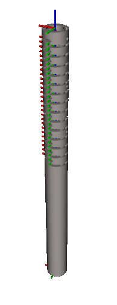

# BIGSS Snake Tool ROS2 Description



## Description

* [snake_arduino](/snake_arduino/): Arduino code for AD7747 and DG4052E.
* [snake_calibration_tool](/snake_calibration_tool/): This directory contains 2 functions. One is to obtain the encoder readings using arduino, and the other is to obtain AD7747 and encoder readings to form CSV.  CSV will be used to calibrate the linear relation between the capacitance reading and degree of bending.
* [snake_capa_msg](/snake_capa_msg/): Customized ROS2 message type for capacitive shape sensing.
* [snake_capa_publisher](/snake_capa_publisher/): Two ROS2 nodes: **capa_publisher** & **capa_mapper** (See below)
* [snake_description](/snake_description/): Snake (CDM) URDF with a GUI.

## Run

Plug in Arduino, and run:

```bash
ros2 run snake_capa_publisher capa_publisher
```

To Calibrate and send the data, run:

```bash
ros2 run snake_capa_publisher capa_mapper
```

To view the snake tool in Rviz2, run:

```bash
ros2 launch snake_description view_snake_tool.launch.py gui:=false
```
